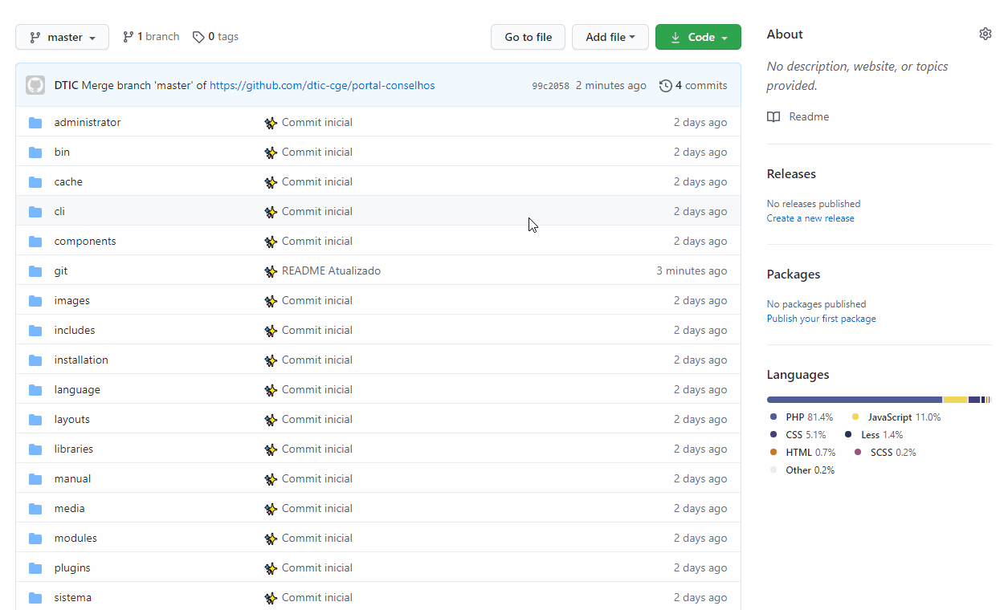

<h1 align="center">
  
</h1>

  <a href="#information_source-sobre">Sobre</a>&nbsp;&nbsp;&nbsp;|&nbsp;&nbsp;&nbsp;
  <a href="#memo-instalação">Instalação</a>

## :information_source: Sobre

O SisPMPI objetiva apoiar a formulação, a execução, o monitoramento e a avaliação dos Planos de Integridade dos órgãos e entidades.

Composto por quatro módulos (formulação, execução, monitoramento e avaliação), cada qual cuidadosamente elaborado para o grupo de usuários que o utilizará de forma mais direta, o SisPMPI é uma inovação que apoiará os gestores públicos e as controladorias setoriais e seccionais na institucionalização do PMPI.

## :memo: Instalação

Realize o download do repositório através da interface do git:

<h1 align="center">
  
</h1>

Após o download da aplicação, realize o passo a passo descrito no [manual](./manual/instalacao.pdf).

---

Feito com :heart: by Diretoria de Tecnologia da Informação e Comunicação

  Controladoria-Geral do Estado de Minas Gerais

